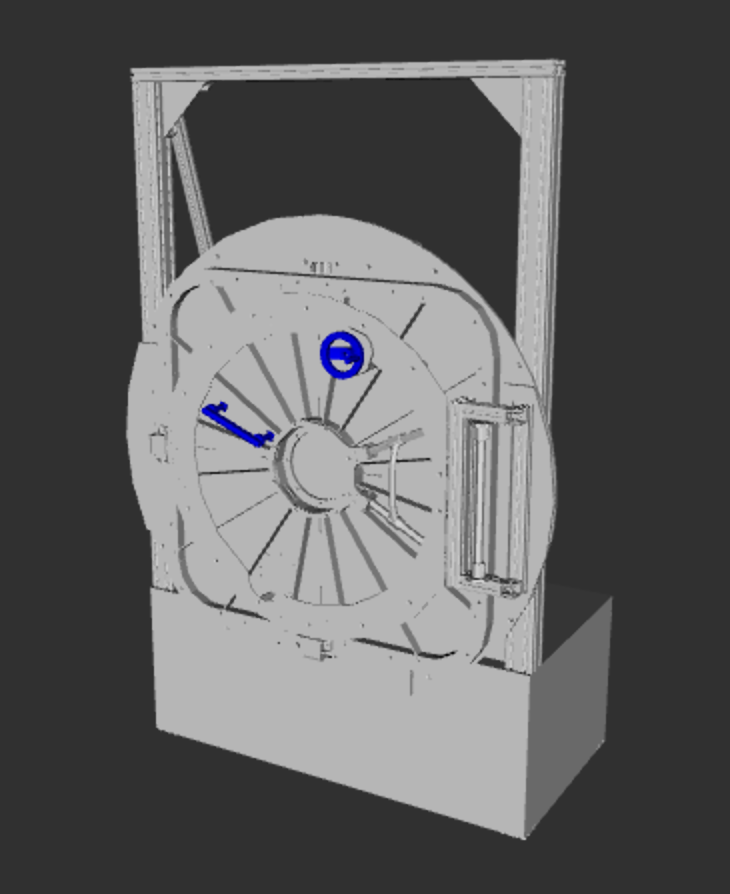
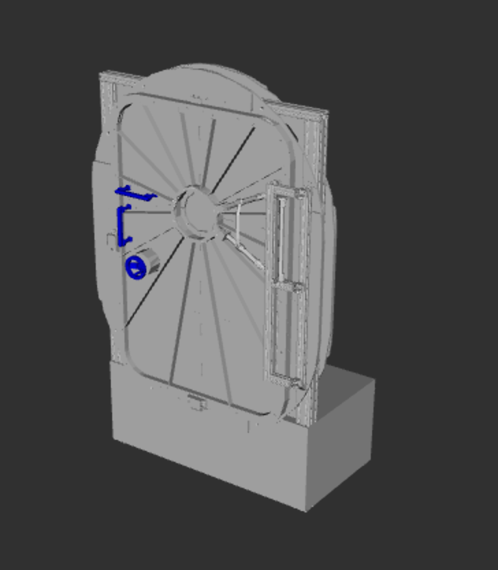
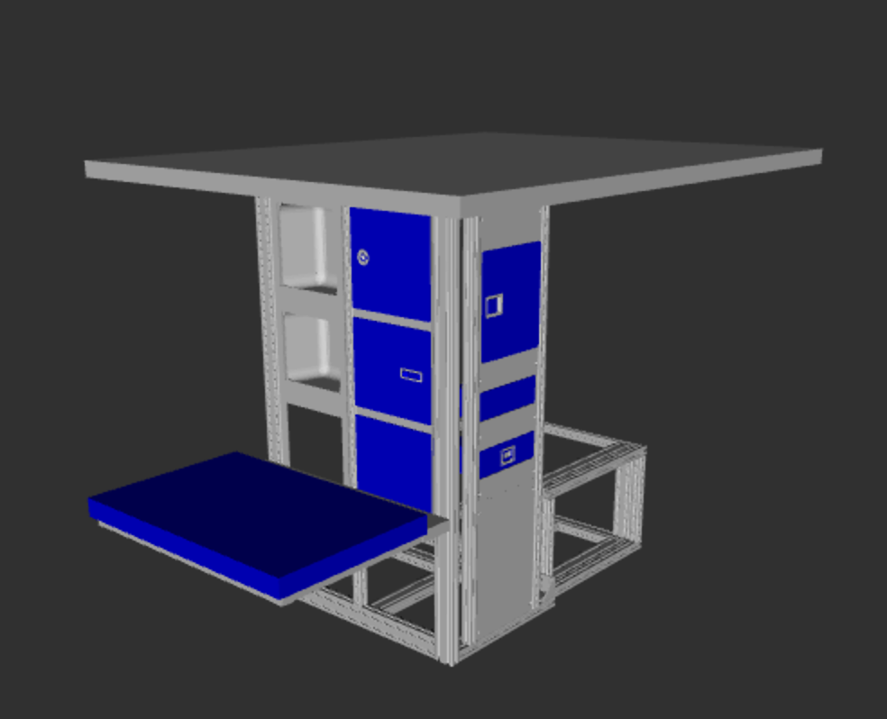
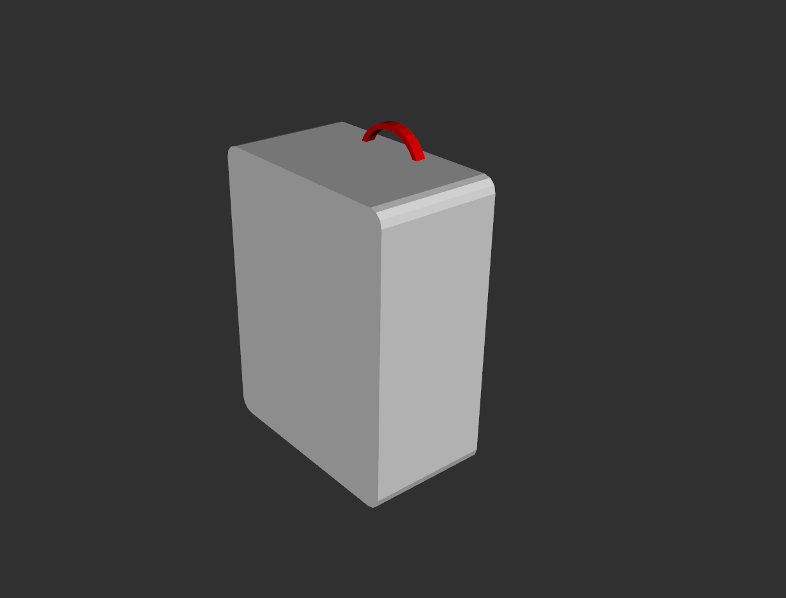

# Surface Robotics Mockups

This repo holds description packages for all mockups used in the iMETRO facility for surface logistics testing.
Components are kept in separate packages to make adjusting experimental setups on hardware easier.

The three primary mockups can be viewed with:

## Hatch 4040

Mockup of a small hatch and bench.
Used for hatch opening and closing, as well as logistics mobility tasks.

```bash
ros2 launch hatch_4040 view.launch.py
```



## Hatch 6060

Mockup of a large hatch and bench.
Used for hatch opening and closing, as well as logistics mobility tasks.

```bash
ros2 launch hatch_4060 view.launch.py
```



## Task Trainer

Mockup of a short bench container and different types of hatches mounted to a frame.
Used for storage and manipulation tasks.

```bash
ros2 launch trainer view.launch.py
```



## CTB

Simplified model of a cargo transfer bag (CTB).



### Citation

This project falls under the purview of the iMETRO project. If you use this in your own work, please cite the following paper:

```bibtex
@INPROCEEDINGS{imetro-facility-2025,
  author={Dunkelberger, Nathan and Sheetz, Emily and Rainen, Connor and Graf, Jodi and Hart, Nikki and Zemler, Emma and Azimi, Shaun},
  booktitle={2025 22nd International Conference on Ubiquitous Robots (UR)},
  title={Design of the iMETRO Facility: A Platform for Intravehicular Space Robotics Research},
  year={2025},
  volume={},
  number={},
  pages={390-397},
  keywords={NASA;Moon;Seals;Maintenance engineering;Maintenance;Robots;Standards;Open source software;Testing;Logistics},
  doi={10.1109/UR65550.2025.11077983}}
```