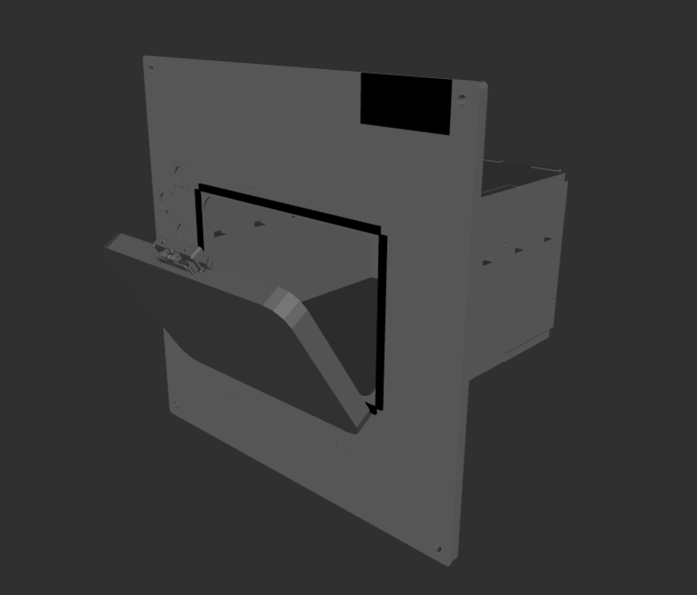

# Merlin Mockups

Description package for [NASA's MERLIN freezers](https://ntrs.nasa.gov/citations/20110010968) for cold storage.

To view the description build the package in an appropriate colcon workspace, then run:

```bash
ros2 launch merlin_mockup_description view_merlin_mockup.launch.py
```


